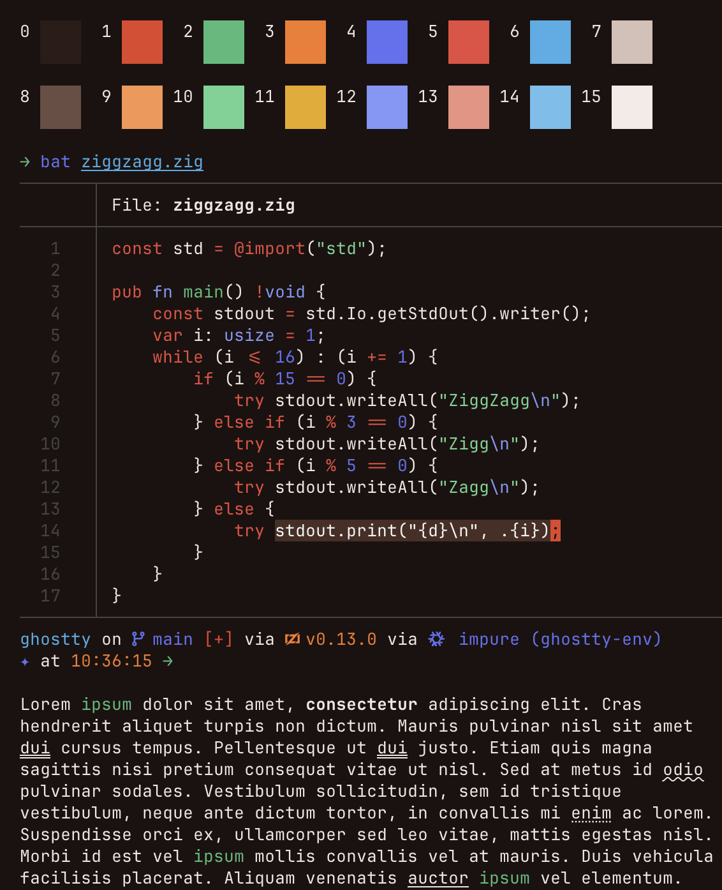
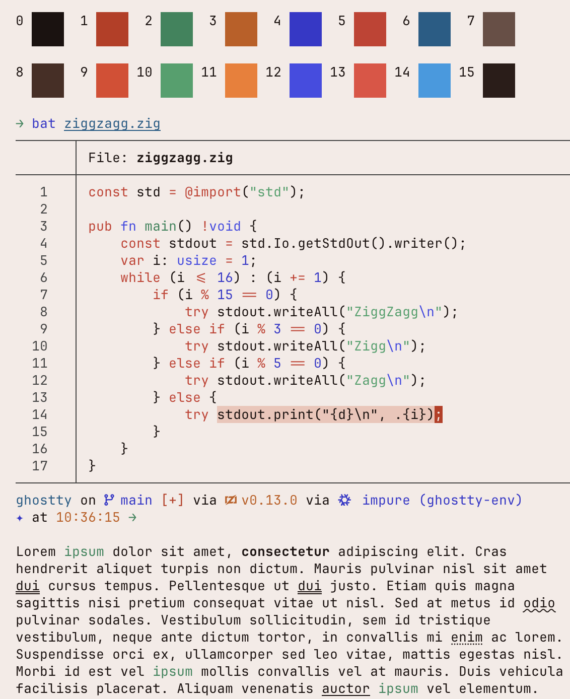

# Redpanda Terminal Themes

Redpanda-branded color schemes for your terminal. Two themes, six terminals.

Warm palettes with red and orange brand colors front and center, inspired by the [Redpanda](https://redpanda.com) brand palette.

## Themes

### Redpanda Dark

Warm reddish-brown background with red/orange dominant colors.



| | bg | fg | cursor | black | red | green | yellow | blue | magenta | cyan | white |
|---|---|---|---|---|---|---|---|---|---|---|---|
| **normal** |  `#1c1210` |  `#f0e6e0` |  `#e24328` |  `#2c1c18` |  `#e24328` |  `#48bb78` |  `#f77923` |  `#6172f3` |  `#ea4a3e` |  `#45ade8` |  `#d4c0b8` |
| **bright** | | | |  `#6b4e44` |  `#f9944f` |  `#68d391` |  `#eaaa08` |  `#8098f9` |  `#ee9281` |  `#6ebfed` |  `#f5ebe6` |

### Redpanda Light

Warm parchment background with darker red/orange variants for contrast.



| | bg | fg | cursor | black | red | green | yellow | blue | magenta | cyan | white |
|---|---|---|---|---|---|---|---|---|---|---|---|
| **normal** |  `#f5ebe6` |  `#1c1210` |  `#c1331a` |  `#1c1210` |  `#c1331a` |  `#25855a` |  `#c55a10` |  `#3538cd` |  `#cd372c` |  `#115d88` |  `#6b4e44` |
| **bright** | | | |  `#4a2e24` |  `#e24328` |  `#38a169` |  `#f77923` |  `#444ce7` |  `#ea4a3e` |  `#1c9be3` |  `#2c1c18` |

## Installation

### Ghostty

Copy the theme file to your Ghostty themes directory and set it in your config:

```bash
# Create the themes directory if it doesn't exist
mkdir -p ~/.config/ghostty/themes

# Copy theme(s)
cp ghostty/redpanda-dark ~/.config/ghostty/themes/
cp ghostty/redpanda-light ~/.config/ghostty/themes/

# Set in ~/.config/ghostty/config
theme = redpanda-dark
```

### iTerm2

1. Open iTerm2 → Preferences → Profiles → Colors
2. Click **Color Presets...** → **Import...**
3. Select the `.itermcolors` file from the `iterm2/` directory
4. Choose the imported preset from the Color Presets dropdown

### Windows Terminal

Add the scheme object from the JSON file to your `settings.json` under the `"schemes"` array:

```jsonc
// In ~/.config/windows-terminal/settings.json (or Settings UI → Open JSON file)
{
  "schemes": [
    // paste contents of windows-terminal/redpanda-dark.json here
  ]
}
```

Then set your profile's `"colorScheme"` to `"Redpanda Dark"` (or Light).

### Alacritty

Import the theme in your Alacritty config:

```toml
# ~/.config/alacritty/alacritty.toml
[general]
import = ["~/redpanda/terminal-themes/alacritty/redpanda-dark.toml"]
```

Or copy the `[colors]` sections into your existing config.

### Kitty

Include the theme in your Kitty config:

```bash
# Option 1: Include in ~/.config/kitty/kitty.conf
include /path/to/redpanda/terminal-themes/kitty/redpanda-dark.conf

# Option 2: Copy to Kitty themes directory
cp kitty/redpanda-dark.conf ~/.config/kitty/themes/
```

### WezTerm

Load the color scheme in your `wezterm.lua`:

```lua
local wezterm = require("wezterm")
local config = wezterm.config_builder()

local redpanda = dofile(os.getenv("HOME") .. "/redpanda/terminal-themes/wezterm/redpanda-dark.lua")
config.colors = redpanda

return config
```

## Color Source

Colors are inspired by the [Redpanda](https://redpanda.com) brand palette. Magenta is shifted toward red and yellow toward orange for a brand-forward look.

## License

[Apache License 2.0](LICENSE)
